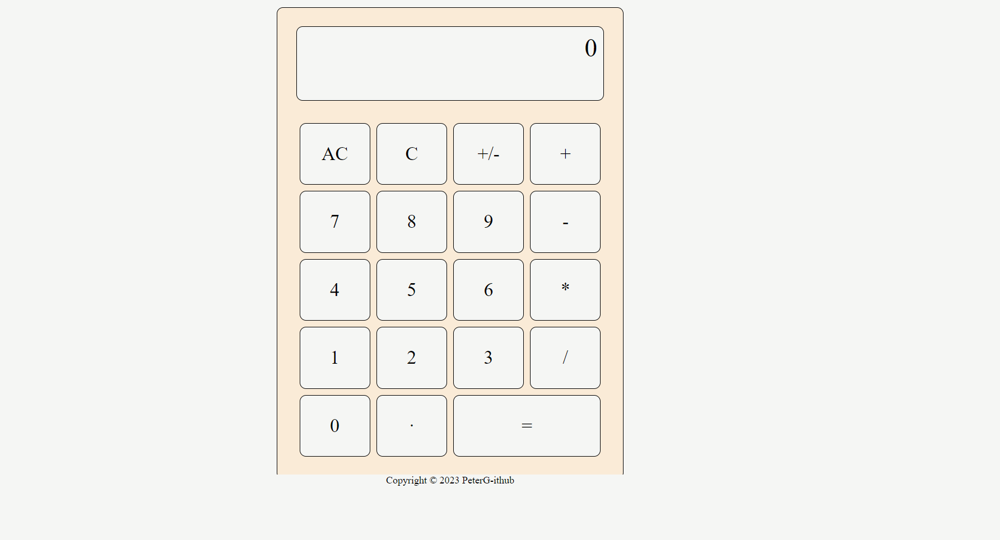

# Calculator App

This project is a simple calculator application developed to perform basic arithmetic operations. It allows users to add, subtract, multiply, and divide numbers, as well as clear the input or reset the calculator.

## Installation
To run this project locally, follow these steps:

1. Clone the repository to your local machine using the following command:
   ```sh
   git@github.com:PeterG-ithub/calculator.git
2. Navigate to the project directory:
    ```sh
   cd calculator
3. Open the `index.html` file in your web browser.

## Technologies Used

- HTML
- CSS
- JavaScript

## Features

- Users can input numbers and perform basic arithmetic operations.
- The calculator displays the result of the operation.
- Users can clear the input or reset the calculator.
- Responsive design for various screen sizes.

## How to Use

1. Visit the live demo link provided above.
2. Click on the buttons to input numbers and operators.
3. Use the "AC" button to clear the input.
4. Use the "C" button to delete the previous character.
5. Use the "=" button to calculate the result.

## Screenshot
Main page
